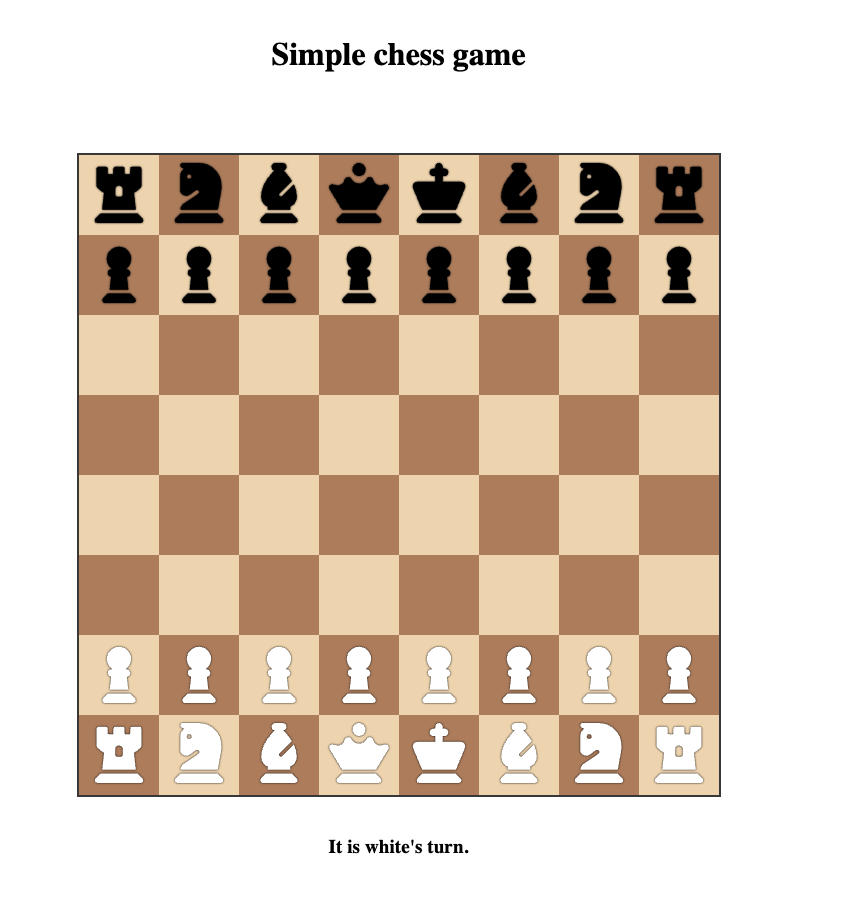

<h1 align="center">Simple chess Game</h1>

  

## Play Chess Here [Simple Chess](https://tiennhann.github.io/chess-game/)

## 🚀 Introduction

Welcome to the Simple JavaScript Chess Game project! This is a lightweight implementation of a chess game using only HTML, CSS, and JavaScript. 

## 🎮 How to Play

1. Open the game in your web browser.
2. Drag a chess piece to select.
3. Drop in a valid place. (you can only place piece on valid spot according to piece.) 
4. The game doesn't include advanced features like check detection, checkmate or pawn promotion.

Remember, this project is designed to be a simple implementation of chess, without complex rules or interactions.

---

Happy coding and playing! 🎲